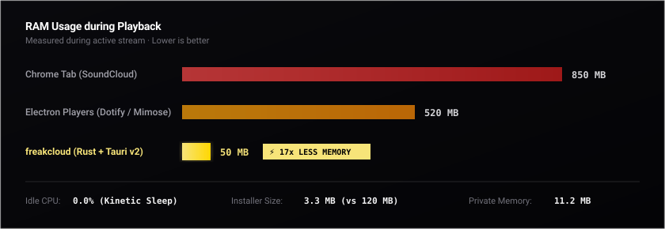

# freakcloud

<p align="center">
  
</p>

<p align="center">
  <strong>Ultra-lightweight, zero-bloat desktop player for SoundCloud.</strong><br>
  Built with Rust & Tauri v2. Runs on ~50 MB RAM with 0.0% idle CPU.
</p>

<p align="center">
  <a href="https://github.com/MinakowDev/freakcloud/releases/latest"></a>
  
  
  
  
</p>

<p align="center">
  <a href="https://github.com/MinakowDev/freakcloud/releases/latest">Download Release (.exe / .msi)</a> •
  <a href="https://minakowdev.github.io/freakcloud/">Website</a> •
  <a href="https://github.com/MinakowDev/freakcloud-extension">Browser Extension</a>
</p>

<p align="center">
  
</p>

---

### Performance

<p align="center">
  
</p>

---

### Features

- **Smart Infinite Wave**: Continuous personal radio powered by SoundCloud Track Stations that learns what you listen to.
- **Offline Disk Cache**: Saves favorite tracks locally for instant playback with zero buffering, even offline.
- **Queue with History**: Jump straight back to recently played tracks in one click without losing your stream.
- **Taste Graph 2.0**: Interactive 2D physics visualization of your musical identity with kinetic sleep (0.0% CPU).
- **Custom Playlists**: Organize tracks with dynamic 2x2 cover collages and in-app SoundCloud search.
- **Studio Crossfade & Discord**: Seamless track transitions, live Discord Rich Presence, and system tray controls.

---

### 1-Click Login

SoundCloud blocks automated sign-ins with DataDome WAF. Connect your account in seconds:

👉 **[freakcloud Sync Extension](https://github.com/MinakowDev/freakcloud-extension)**

1. Install the extension in Chrome, Edge, Brave, or Yandex.
2. Log into [soundcloud.com](https://soundcloud.com).
3. The extension instantly syncs your session to the desktop app in 1 click.

---

### Development

```bash
# Clone repository
git clone https://github.com/MinakowDev/freakcloud.git
cd freakcloud/freakcloud

# Install dependencies & run dev
bun install
bun tauri dev

# Build release executable
bun tauri build
```

---

### License

[MIT License](LICENSE) • Built for pure listening pleasure.
